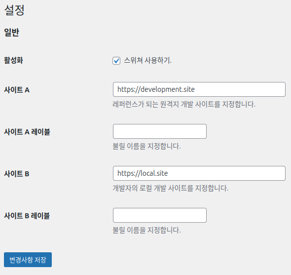

# Easy Site Switcher

개발 / 로컬 사이트 전환을 쉽게 하기 위한 도구

## 개요

워드프레스를 기반의 사이트를 제작할 때, 보통 레퍼런스인 원격 개발 사이트를 하나 운영하고,
개발자는 로컬 PC에 이 레퍼런스 사이트를 복제하여 별도의 격리된 환경에서 작업합니다.

이렇게 개발 환경이 이원화될 때, 개발자는 매우 빈번하게 원격 개발 사이트와 로컬 PC 사이트를
번갈아 가면서 접속하여 각 페이지별로 비교 검증하는 과정을 거치게 됩니다.

그런데 이 과정에서 일일이 웹브라우저에 도메인을 수동으로 변경하는 것은 매우 귀찮은 일입니다.
이 플러그인은 같은 경로상의 원격 개발 사이트와 로컬 사이트를 손쉽게 전환하는 단순하지만 유용한 기능을 제공합니다.

## 사용법

1. 워드프레스 플러그인으로 설치합니다.
2. Easy Site Switcher 플러그인을 활성화 합니다.
3. 관리자 > 도구 > Easy Site Switcher 메뉴로 이동합니다.
4. '사이트 A'에 원격 개발 사이트의 주소를 적습니다. 'http' 로 시작하고 뒤에 '/'는 붙이지 않습니다.
5. '사이트 B'에 개발자의 로컬 PC 의 주소를 적습니다. 'http' 로 시작하고 뒤에 '/'는 붙이지 않습니다.
6. '사이트 A 레이블', '사이트 'B 레이블'에 각각 서버를 부를 호칭을 별도로 지정합니다.
   기본은 각각 '사이트 A', '사이트 B'입니다.
7. 활성화 체크박승 체크합니다.
8. '변경사항 저장' 버튼을 누릅니다.
9. 현재 사이트의 주소에 따라 페이지 전환 가능한 버튼이 어드민 바에 생성됩니다.

